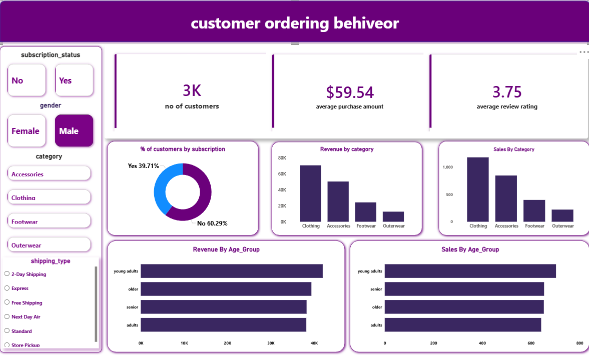

# Customer Behavior Data Analysis

## Project Overview
This project demonstrates an end-to-end data analytics workflow using Python, SQL, and Power BI. The objective is to analyze customer shopping behavior, identify purchasing patterns, and generate actionable business insights.

## Dataset
Customer shopping behavior dataset containing:
- Customer demographics
- Purchase history
- Product categories
- Spending patterns
- Loyalty information

## Tools & Technologies
- Python (Pandas, NumPy, Matplotlib, Seaborn)
- SQL (MySQL/PostgreSQL)
- Power BI

## Project Workflow

### Data Cleaning & Preparation (Python)
- Data exploration
- Missing value handling
- Data transformation
- Feature engineering

### Data Analysis (SQL)
- Customer segmentation
- Revenue analysis
- Purchase behavior analysis
- Loyalty analysis

### Dashboard Development (Power BI)
- KPI tracking
- Customer insights
- Sales trends
- Interactive visualizations

## Key Business Questions
1. Which customer segments generate the highest revenue?
2. What factors influence customer spending?
3. How does customer loyalty affect purchases?
4. Which products perform best?
5. What trends can improve business performance?

## Key Insights
- Identified high-value customer groups
- Analyzed purchasing frequency patterns
- Evaluated loyalty program effectiveness
- Discovered top-performing product categories

## Skills Demonstrated
- Data Cleaning
- Exploratory Data Analysis (EDA)
- SQL Querying
- Data Modeling
- Power BI Dashboarding
- Business Analytics
- Data Storytelling

## Dashboard Preview

## Project Outcome
This project demonstrates the complete data analytics lifecycle, from raw data preparation to business insight generation and dashboard development.
